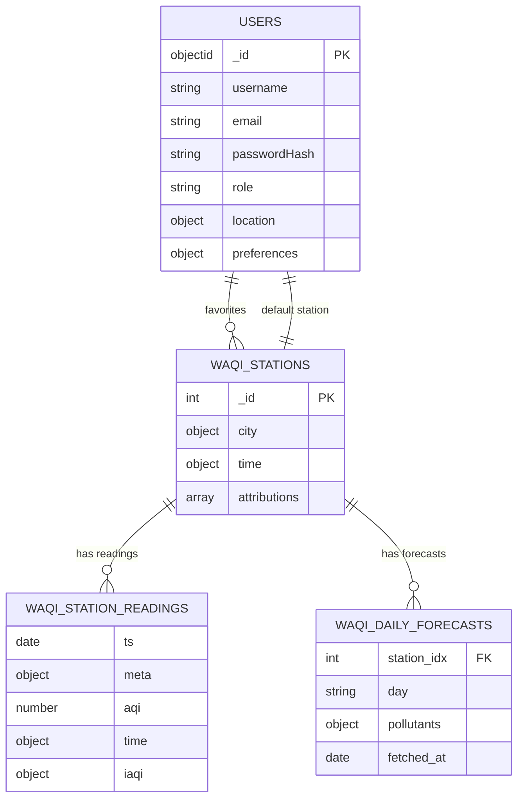

# Air Quality Monitoring System - MongoDB Schema Documentation

**Version:** 2.0  
**Last Updated:** December 7, 2024  
**Project:** Air Quality Monitoring System (WAQI Integration)

---

## 📋 Overview

This document defines the MongoDB database schema for an Air Quality Monitoring System that integrates with the **World Air Quality Index (WAQI) API**. The system stores air quality data, station information, forecasts, and user management data in a structured and optimized format.

### Key Design Principles

- **🎯 Data Integrity**: Store only verified data from WAQI API responses
- **⚡ Performance-First**: Optimized for common query patterns (nearest station, latest readings, trends)
- **🌍 Geospatial-Ready**: GeoJSON format with 2dsphere indexes for location-based queries
- **📊 Time-Series Optimized**: Dedicated time-series collection for efficient historical data storage
- **🔒 Security-Focused**: Proper validation and user role management
- **📈 Scalable**: Designed for high-volume data ingestion and retrieval

---

## 🗂️ Collections Architecture

| Collection | Purpose | Type | Records |
|------------|---------|------|---------|
| `waqi_stations` | Station metadata and location info | Standard | ~10K stations |
| `waqi_station_readings` | Time-series air quality measurements | Time-Series | Millions of readings |
| `waqi_daily_forecasts` | Daily air quality forecasts by pollutant | Standard | ~365 days × stations |
| `users` | User accounts, preferences, and authentication | Standard | Application users |

---

## 🏭 Collection 1: `waqi_stations`

**Purpose**: Store metadata for air quality monitoring stations including location, timezone, and attribution information.

### 📄 Document Schema

```json
{
  "_id": 7397,
  "city": {
    "name": "Chi_sp, Illinois",
    "url": "https://aqicn.org/city/usa/illinois/chi_sp/",
    "geo": {
      "type": "Point",
      "coordinates": [-87.723900, 41.913600]
    }
  },
  "time": {
    "tz": "-06:00"
  },
  "attributions": [
    {
      "name": "EPA",
      "url": "https://www.epa.gov/",
      "logo": "https://example.com/epa-logo.png"
    }
  ]
}
```

### 🔧 Field Specifications

| Field | Type | Required | Description |
|-------|------|----------|-------------|
| `_id` | Integer | ✅ | WAQI station index (used as primary key) |
| `city.name` | String | ✅ | Station display name |
| `city.url` | String | ✅ | WAQI station URL |
| `city.geo.type` | String | ✅ | Always "Point" (GeoJSON) |
| `city.geo.coordinates` | Array[Number] | ✅ | [longitude, latitude] coordinates |
| `time.tz` | String | ❌ | Station timezone offset (e.g., "-06:00") |
| `attributions` | Array | ❌ | Data source attributions |
| `attributions[].name` | String | ❌ | Attribution source name |
| `attributions[].url` | String | ❌ | Attribution source URL |
| `attributions[].logo` | String | ❌ | Attribution logo URL |

### 📊 Indexes

```javascript
// Primary key (automatic)
db.waqi_stations.createIndex({ _id: 1 }, { unique: true });

// Geospatial queries (nearest station)
db.waqi_stations.createIndex({ "city.geo": "2dsphere" });

// Station lookup by name
db.waqi_stations.createIndex({ "city.name": 1 });

// Station lookup by URL
db.waqi_stations.createIndex({ "city.url": 1 });
```

### 🔍 Common Queries

```javascript
// Find nearest station to user location
db.waqi_stations.findOne({
  "city.geo": {
    $near: {
      $geometry: { type: "Point", coordinates: [106.7009, 10.7769] },
      $maxDistance: 50000 // 50km radius
    }
  }
});

// Find stations by name pattern
db.waqi_stations.find({
  "city.name": { $regex: "Chicago", $options: "i" }
});
```

---

## 📊 Collection 2: `waqi_station_readings`

**Purpose**: Time-series collection storing air quality measurements with full historical data for trend analysis.

### 📄 Document Schema

```json
{
  "ts": "2024-12-07T15:00:00.000Z",
  "meta": {
    "station_idx": 7397
  },
  "aqi": 71,
  "time": {
    "v": 1733581200,
    "s": "2024-12-07 15:00:00",
    "tz": "-06:00"
  },
  "iaqi": {
    "pm25": { "v": 71 },
    "pm10": { "v": 55 },
    "o3": { "v": 42 },
    "no2": { "v": 28 }
  }
}
```

### 🔧 Field Specifications

| Field | Type | Required | Description |
|-------|------|----------|-------------|
| `ts` | Date | ✅ | UTC timestamp (derived from time.s + tz) |
| `meta.station_idx` | Integer | ✅ | Reference to waqi_stations._id |
| `aqi` | Number | ✅ | Overall Air Quality Index |
| `time.v` | Long | ❌ | Unix timestamp from WAQI |
| `time.s` | String | ✅ | Local timestamp string from WAQI |
| `time.tz` | String | ✅ | Timezone offset |
| `iaqi` | Object | ❌ | Individual pollutant measurements |
| `iaqi.{pollutant}.v` | Number | ❌ | Pollutant-specific AQI value |

### 📊 Time-Series Configuration

```javascript
db.createCollection("waqi_station_readings", {
  timeseries: {
    timeField: "ts",
    metaField: "meta", 
    granularity: "hours"
  }
});
```

### 📊 Indexes

```javascript
// Station + time queries (most common)
db.waqi_station_readings.createIndex({ "meta.station_idx": 1, ts: -1 });

// AQI ranking queries
db.waqi_station_readings.createIndex({ aqi: -1, ts: -1 });

// Optional: TTL for data retention (365 days)
// db.waqi_station_readings.createIndex({ ts: 1 }, { expireAfterSeconds: 31536000 });
```

### 🔍 Common Queries

```javascript
// Latest reading for a station
db.waqi_station_readings.findOne(
  { "meta.station_idx": 7397 },
  { sort: { ts: -1 } }
);

// Hourly readings for last 24 hours
db.waqi_station_readings.find({
  "meta.station_idx": 7397,
  ts: { $gte: new Date(Date.now() - 24 * 60 * 60 * 1000) }
}).sort({ ts: -1 });

// Stations with highest AQI in last hour
db.waqi_station_readings.aggregate([
  { $match: { ts: { $gte: new Date(Date.now() - 60 * 60 * 1000) } } },
  { $sort: { "meta.station_idx": 1, ts: -1 } },
  { $group: { _id: "$meta.station_idx", latestReading: { $first: "$$ROOT" } } },
  { $sort: { "latestReading.aqi": -1 } },
  { $limit: 10 }
]);
```

---

## 🔮 Collection 3: `waqi_daily_forecasts`

**Purpose**: Store daily air quality forecasts by pollutant type for each monitoring station.

### 📄 Document Schema

```json
{
  "station_idx": 7397,
  "day": "2024-12-07",
  "pollutants": {
    "pm25": {
      "avg": 45,
      "min": 35,
      "max": 65
    },
    "pm10": {
      "avg": 55,
      "min": 40,
      "max": 75
    },
    "o3": {
      "avg": 35,
      "min": 20,
      "max": 50
    },
    "uvi": {
      "avg": 6,
      "min": 3,
      "max": 9
    }
  },
  "fetched_at": "2024-12-07T12:00:00.000Z"
}
```

### 🔧 Field Specifications

| Field | Type | Required | Description |
|-------|------|----------|-------------|
| `station_idx` | Integer | ✅ | Reference to waqi_stations._id |
| `day` | String | ✅ | Forecast date in YYYY-MM-DD format |
| `pollutants` | Object | ✅ | Pollutant-specific forecasts |
| `pollutants.{pollutant}.avg` | Number | ✅ | Average predicted value |
| `pollutants.{pollutant}.min` | Number | ✅ | Minimum predicted value |
| `pollutants.{pollutant}.max` | Number | ✅ | Maximum predicted value |
| `fetched_at` | Date | ❌ | When forecast was retrieved |

### 📊 Indexes

```javascript
// Unique constraint per station per day
db.waqi_daily_forecasts.createIndex(
  { station_idx: 1, day: 1 }, 
  { unique: true }
);

// Date-based queries
db.waqi_daily_forecasts.createIndex({ day: 1 });

// Station-based queries
db.waqi_daily_forecasts.createIndex({ station_idx: 1 });
```

### 🔍 Common Queries

```javascript
// Get 7-day forecast for a station
db.waqi_daily_forecasts.find({
  station_idx: 7397,
  day: { 
    $gte: "2024-12-07", 
    $lte: "2024-12-14" 
  }
}).sort({ day: 1 });

// Find stations with high PM2.5 forecast tomorrow
db.waqi_daily_forecasts.find({
  day: "2024-12-08",
  "pollutants.pm25.avg": { $gte: 100 }
});
```

---

## 👥 Collection 4: `users`

**Purpose**: User account management, authentication, and personalization preferences.

### 📄 Document Schema

```json
{
  "_id": ObjectId("674b1a2b3c4d5e6f78901234"),
  "username": "john_doe",
  "email": "john.doe@example.com",
  "passwordHash": "$2b$12$LQv3c1yqBwn/M9ihlhq3UO",
  "role": "user",
  "location": {
    "type": "Point",
    "coordinates": [106.7009, 10.7769]
  },
  "preferences": {
    "language": "en",
    "theme": "dark",
    "favoriteStations": [7397, 8123, 9456],
    "defaultStation": 7397,
    "notifications": {
      "email": true,
      "push": false,
      "threshold": 100
    }
  },
  "createdAt": "2024-12-07T10:30:00.000Z",
  "updatedAt": "2024-12-07T15:45:00.000Z"
}
```

### 🔧 Field Specifications

| Field | Type | Required | Description |
|-------|------|----------|-------------|
| `username` | String | ✅ | Unique username |
| `email` | String | ✅ | User email (unique) |
| `passwordHash` | String | ✅ | Bcrypt password hash |
| `role` | String | ✅ | "user" or "admin" |
| `location.type` | String | ❌ | Always "Point" (GeoJSON) |
| `location.coordinates` | Array[Number] | ❌ | [longitude, latitude] |
| `preferences.language` | String | ❌ | UI language preference |
| `preferences.theme` | String | ❌ | "light" or "dark" |
| `preferences.favoriteStations` | Array[Integer] | ❌ | Bookmarked station IDs |
| `preferences.defaultStation` | Integer | ❌ | Default station for dashboard |
| `preferences.notifications` | Object/Boolean | ❌ | Notification settings |
| `createdAt` | Date | ❌ | Account creation timestamp |
| `updatedAt` | Date | ❌ | Last update timestamp |

### 📊 Indexes

```javascript
// Unique constraints
db.users.createIndex({ email: 1 }, { unique: true });
db.users.createIndex({ username: 1 }, { unique: true });

// Geospatial queries for location-based features
db.users.createIndex({ location: "2dsphere" });

// Role-based queries
db.users.createIndex({ role: 1 });
```

### 🔍 Common Queries

```javascript
// Find user by email (login)
db.users.findOne({ email: "john.doe@example.com" });

// Find users near a location
db.users.find({
  location: {
    $near: {
      $geometry: { type: "Point", coordinates: [106.7009, 10.7769] },
      $maxDistance: 10000
    }
  }
});

// Count admin users
db.users.countDocuments({ role: "admin" });
```

---

## 🔗 Data Relationships

### Entity Relationship Diagram



### Reference Integrity

- `waqi_station_readings.meta.station_idx` → `waqi_stations._id`
- `waqi_daily_forecasts.station_idx` → `waqi_stations._id`
- `users.preferences.favoriteStations[]` → `waqi_stations._id`
- `users.preferences.defaultStation` → `waqi_stations._id`

---

## 🛠️ Database Setup Scripts

### Create Collections with Validators

Use the MongoDB scripts located in `docs/schema/mongo_create_collections/`:

```bash
# Create all collections with validators and indexes
mongosh your_database < docs/schema/mongo_create_collections/create_waqi_stations.js
mongosh your_database < docs/schema/mongo_create_collections/create_waqi_station_readings.js
mongosh your_database < docs/schema/mongo_create_collections/create_waqi_daily_forecasts.js
mongosh your_database < docs/schema/mongo_create_collections/create_users.js
```

### Validation Schemas

JSON Schema validators are available in `docs/schema/mongo_validators/` for:
- `waqi_stations.validator.json`
- `waqi_station_readings.validator.json`
- `waqi_daily_forecasts.validator.json`
- `users.validator.json`

---

## 📈 Performance Considerations

### Index Strategy

- **Geospatial**: 2dsphere indexes for location-based queries
- **Time-Series**: Compound indexes on station + timestamp
- **Unique Constraints**: Email, username, station+day combinations
- **Text Search**: Consider adding text indexes for station names

### Query Optimization

- Use projection to limit returned fields
- Implement pagination for large result sets
- Cache frequently accessed station metadata
- Use aggregation pipelines for complex analytics

### Data Retention

- Consider TTL indexes for historical readings
- Implement archival strategy for old forecasts
- Regular cleanup of inactive user accounts

---

## 🔒 Security Considerations

- All passwords stored as bcrypt hashes
- Input validation through MongoDB validators
- Role-based access control (user/admin)
- Geolocation privacy settings
- Rate limiting for API endpoints

---

## 📚 Additional Resources

---

## 🚦 Data Ingestion Workflow (Current Readings)

### Overview

The ingestion pipeline fetches current air quality readings for all stations from the WAQI API and stores them in MongoDB. It is designed for reliability, duplicate prevention, and safe re-ingestion.

### Key Features

- **Checkpoint Mechanism**: Prevents duplicate ingestion by tracking the last processed time.
- **Station-level Duplicate Prevention**: Each station document (`waqi_stations`) tracks its own `latest_update_time` field. Before inserting a new reading, the system checks this field to avoid duplicate data for the same time period.
- **Time-Series Storage**: All readings are stored in the `waqi_station_readings` time-series collection, optimized for historical and trend queries.
- **Reset Option**: The ingestion script supports a `--reset-stations` flag to clear all `latest_update_time` fields, allowing a full reload of current data from scratch (useful for recovery or testing).
- **Dry-Run Mode**: Use `--dry-run` to simulate ingestion without modifying the database.

### Ingestion Script Usage

```bash
# Normal ingestion (skips duplicates)
python ingest/get_station_reading.py --log-level INFO

# Force reload all stations (clear duplicate tracking)
python ingest/get_station_reading.py --reset-stations --log-level INFO

# Dry-run (no DB changes)
python ingest/get_station_reading.py --dry-run --log-level DEBUG
```

### How Duplicate Prevention Works

1. **Checkpoint**: The script saves a checkpoint after each successful run, recording the last processed time.
2. **Per-Station Check**: Before inserting a reading, the script compares the incoming reading's time with the station's `latest_update_time`.
   - If the times match, the reading is skipped (duplicate).
   - If the time is new, the reading is inserted and `latest_update_time` is updated.
3. **Reset**: Using `--reset-stations` removes all `latest_update_time` fields, so all stations are eligible for re-ingestion.

### Example Document (waqi_stations)

```json
{
  "_id": 7397,
  "city": { ... },
  "latest_update_time": { "s": "2025-09-11 13:00:00", "tz": "+07:00" }
}
```

### Example Document (waqi_station_readings)

```json
{
  "ts": "2025-09-11T06:00:00.000Z",
  "meta": { "station_idx": 7397 },
  "aqi": 71,
  "time": { "s": "2025-09-11 13:00:00", "tz": "+07:00" },
  "iaqi": { "pm25": { "v": 71 } }
}
```

### Operational Notes

- The ingestion script is idempotent: running it multiple times for the same time window will not create duplicates.
- Use the reset feature with caution; it is intended for full reloads or recovery scenarios.
- All timestamps are handled in UTC internally; local time and timezone are stored for reference.

---

- [MongoDB Time Series Collections](https://docs.mongodb.com/manual/core/timeseries-collections/)
- [GeoJSON Specification](https://geojson.org/)
- [WAQI API Documentation](https://aqicn.org/json-api/doc/)
- [MongoDB Schema Validation](https://docs.mongodb.com/manual/core/schema-validation/)

---

*This schema documentation is version-controlled and should be updated whenever database structure changes occur.*
